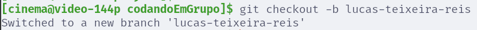
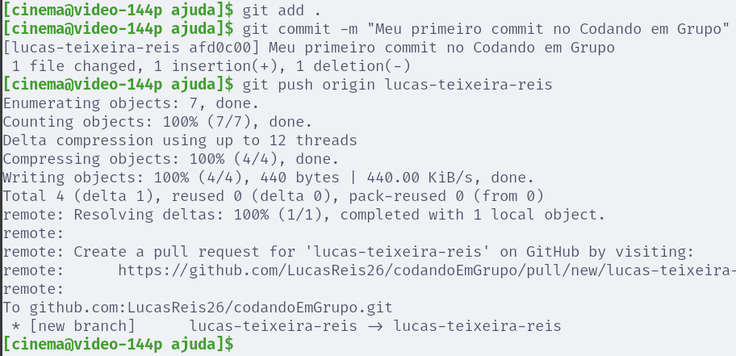
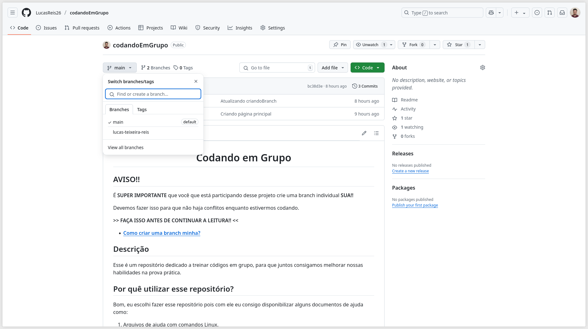

<h1 align="center">Como criar minha branch?</h1>

## 1º Passo:

Me envie seu email cadastrado no GitHub para que eu possa te adicionar como colaborador do repositório. 

Dessa forma você será capaz de criar branches, dar _git pull_, _git commit_, _git push_ e muitos outros comandos que serão abordados no documento do GitHub.

## 2º Passo:

Sendo adicionado como colaborador, agora você deve clonar o repositório na sua máquina utilizando o comando abaixo:

```
git clone git@github.com:LucasReis26/codandoEmGrupo.git
```

_Obs.: para utilizar o este comando, vocês devem ter configurado a chave SSH no computador de vocês, se vocês não sabem fazer isso eu recomendo acessar o link abaixo_

- [**Conectar-se ao GitHub com o SSH**](https://docs.github.com/en/authentication/connecting-to-github-with-ssh)

## 3º Passo:

Agora que você é colaborador e tem acesso ao repositório, devemos criar a sua branch então siga os passos:

#### 1. Vá até o repositório clonado via terminal e digite o seguinte comando:   


```
git checkout -b nomeDaSuaBranch
```

_Obs.: Para facilitar a localização recomendo utilizar seu nome na branch_



---


#### 2. Agora precisamos enviar essa nova branch para o GitHub, para isso assine seu nome utilizando o editor de texto de sua preferência:


> **Essa branch pertence a:** "Lucas Fernandes Marinho"

---


#### 3. Com o seu nome assinado, faça seu primeiro push com os comandos abaixo:

```
git add .;
git commit -m "Meu primeiro commit no Codando em Grupo";
git push origin **SUBISTITUA COM O NOME DA SUA BRANCH**
```
_Obs.: No meu caso minha branch se chama lucas-teixeira-reis_



---

#### 4. Apenas para verificar se tudo deu certo, vá ao repositório no GitHub e verifique se sua branch foi criada:

Deve aparecer dessa forma:


